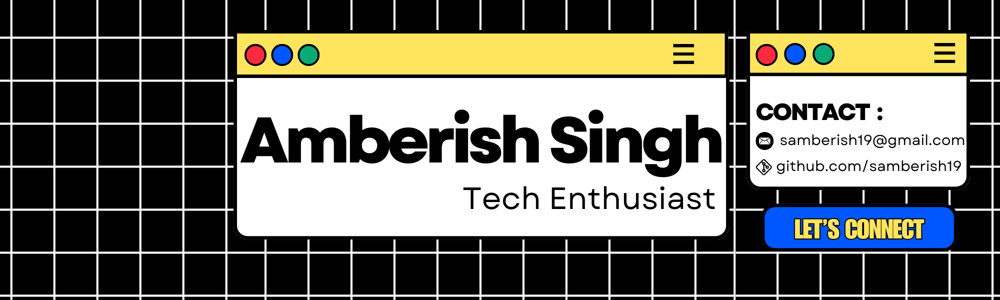

## Hey , I'm Amberish Singh — an Aspiring Software Engineer 👨‍💻

   
### Glad to see you here!

Software engineering is where my passion meets my hobby. I’m always excited to talk about tech, products, business ideas, or any new opportunity.
Right now, I’m focused on Data Analysis, ETL pipelines, real-world datasets, and sharpening my technical foundation as I grow my career 🚀.
  

### Talking about Personal Stuffs:

- 🛠 &nbsp; I'm currently working on data engineering, automation, and exploratory data analysis projects using Python (Pandas, NumPy), MySQL, and visualization tools.
- 🚀 &nbsp; I’m currently learning and deepening my understanding of SQL optimization, ETL pipelines, data validation, database design, and Python automation.
- 💬 &nbsp; I read & write about tech, development, and my project experiences (planning to start blogging soon!).
- 📰 &nbsp; I explore new tech regularly and love sharing insights through LinkedIn & GitHub updates.
- 👾 &nbsp; Fun fact: I love debugging and optimizing SQL queries more than writing them!.
- 📫 &nbsp; How to reach me: samberish19@gmail.com

  

### My Absolute Favorites:

- 💻 &nbsp; Exploring new stacks and building cool projects is my favorite way to learn.
- 📰 &nbsp; I like reading tech blogs, case studies, and documentation—sometimes even writing my own.
- 🍕 &nbsp; Hackathons, coding contests, and late-night debugging sessions are totally my vibe.

<h3 align="left">Languages and Tools:</h3>

                

<h3 align="left">Connect with me:</h3>

### Projects and Dev Stuffs: 
  ⚡ Github Stats

&nbsp;

  

 
### ⚙️ Tools & Technologies I Work With
<ul> <li><b>OS:</b> Windows / Linux (WSL & Ubuntu for development)</li> <li><b>Browser:</b> Chrome / Brave</li> <li><b>Code Editor:</b> Visual Studio Code (my primary editor)</li> <li><b>For Data Work:</b> Jupyter Notebook, Python (Pandas, NumPy), MySQL Workbench</li> <li><b>For Version Control:</b> Git & GitHub</li> <li><b>To Stay Updated:</b> Medium, Dev.to, YouTube (Tech channels), LinkedIn</li> </ul>

<b>No blog link yet — but planning to start writing about my projects and learning journey soon!</b>

  

 

<b>❝ While you are here, here’s an Office quote for you</b>

 

 > The quote is powered by ["The Office API"](https://github.com/AkashRajpurohit/the-office-api) project

